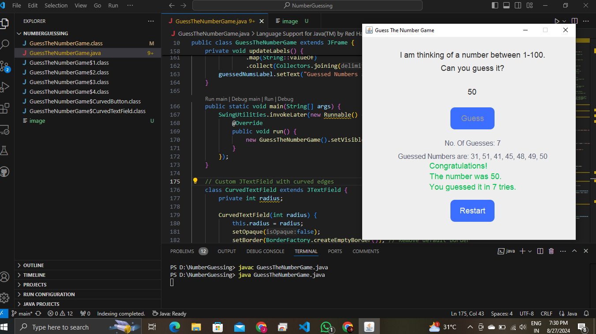

# Guess The Number Game 🎮

A simple and interactive Number Guessing Game built using Java Swing and AWT. The game picks a random number between 1 and 100, and your goal is to guess it in as few tries as possible. The game gives you hints whether your guess is too high or too low.

## Features
- Interactive GUI with custom curved input fields and buttons.
- Displays the number of guesses and a list of all previous guesses.
- Option to restart the game and try again.
- Hints provided for every guess (too high, too low, or correct).

## How to Play
1. Run the program.
2. Enter a number between 1 and 100.
3. Click the "Guess" button or press "Enter" to submit your guess.
4. The game will tell you if your guess is too high, too low, or correct.
5. Keep guessing until you find the correct number.
6. Once you guess the correct number, you can restart the game by clicking the "Restart" button.

## Screenshots
 <!-- Make sure to add the screenshot in the appropriate path -->

## How to Run
1. Ensure you have Java installed on your machine.
2. Clone this repository or download the `.java` file.
3. Compile the program:
    ```bash
    javac GuessTheNumberGame.java
    ```
4. Run the program:
    ```bash
    java GuessTheNumberGame
    ```

## Project Structure
- **GuessTheNumberGame.java**: The main Java file containing the game logic and GUI.

## Custom Components
This project includes two custom GUI components:
- **CurvedTextField**: A JTextField with curved edges.
- **CurvedButton**: A JButton with rounded corners and custom styling.

## Dependencies
- Java (JDK 8 or later)

## Contributing
Feel free to fork this repository, create a feature branch, and submit a pull request. All contributions are welcome!
